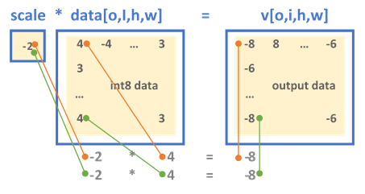
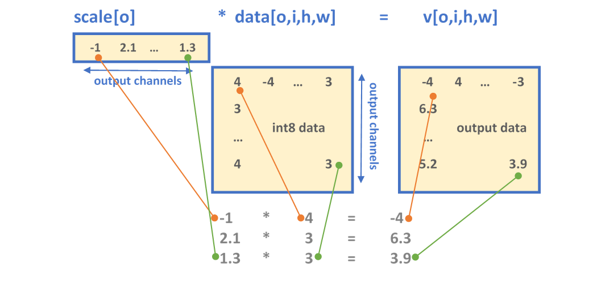
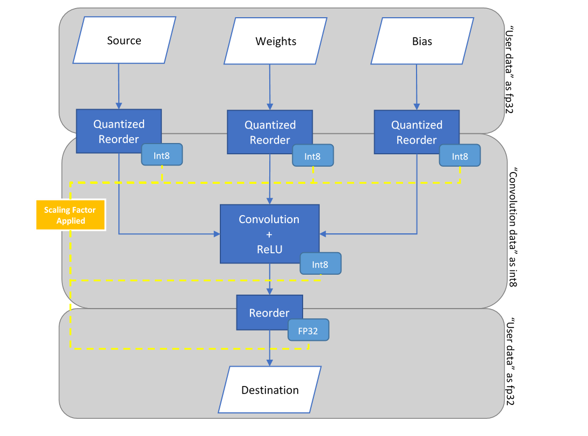

# Introduction to Low-Precision 8-bit Integer Computations

> \f$\dagger\f$ Disclaimer: MKLDNN Int8 primitives are a work in progress and not all
> definitions and configurations have been implemented or included in the documentation.
> Moreover, the example included in this documentation relies on int8 primitives
> which use the **MKL binary dependency** and is limited to MKLDNN built with
> the MKL binary.

## Introduction

To push higher performance during inference computations, recent work has focused
on computing at a lower precision (i.e. shrinking the size of data for activations
and weights) to achieve higher throughput. Eight-bit computations (referred to as int8)
offer improved performance over higher precision types -because it allows packing more
data into a single instruction, at the cost of reduced but acceptable accuracy.

## Int8 Workflow

### Quantization Process
To operate with int8 data types from a higher precision format (e.g. 32-bit floating point),
data must first be _quantized_. The quantization process converts a given input into a
lower-precision format. The precision and accuracy factors are determined by the
scale and rounding-mode respectively.

### Scale
The scale is usually obtained from sampling the dataset of previous executions in
the original format (e.g. the activations and weights from training in fp32)
and is formulated as:

+ \f$ R_{\{\alpha,w\}} = max(abs(T_{\{\alpha,w\}}))\f$\n
where \f$ T_{\{\alpha,w\}}\f$ is a tensor corresponding
to either the weights \f$w\f$ or the activations \f$\alpha\f$.

The purpose is to establish the range of values used in the computation
where selecting a proper scaling factor prevents over or underflows when
computing the lower precision results.

### Quantization Factor
The next step is to calculate the **quantization factor** for converting the values
into the corresponding int8 range. This is also known as the **scale** or
**scaling factor** applied to the original high-precision values and is
calculated as:

+ \f$ Q_{\alpha} = \frac{255}{R_{\alpha}}\f$ is the
quantization factor for activations with non-negative values.

+ \f$ Q_{w} = \frac{127}{R_{w}}\f$ is the quantization factor for weights.

The low-precision values, known as the **quantized** activation, weights, and bias values
are calculated as:
+ \f$\alpha_{u8} = \lceil Q_{\alpha} \alpha_{f32} \rceil \in [0,255]\f$
+ \f$W_{s8} = \lceil Q_{w} W_{f32} \rceil \in [-127,127]\f$
+ \f$b_{s32} = \lceil Q_{\alpha} Q_{w} b_{f32} \rceil \in [-2^{31},2^{31}-1]\f$\n
where the function \f$ \lceil   \rceil \f$ rounds to the selected rounding mode.

When the destination value (e.g. from a convolution) is stored
as a signed 32-bit integer, the result is bound to the same quantization
*scaling* factors:
+ \f$ X_{s32} = W_{s8} \times \alpha{u8} + b_{s32} \approx Q_{\alpha} Q_{\omega} X_{f32}\f$
+ where \f$X_{f32} = W_{f32} \times \alpha_{f32} + b_{f32}\f$

Where the approximated value is due to the rounded values.

Inversely, the dequantized value is calculated as:
+ \f$ X_{f32} \approx \frac{1}{Q_{\alpha} Q_{\omega}} X_{s32} \f$

### Quantization Example
To show how the int8 parameters are obtained, suppose we first start off with a
set of arbitrary high-precision input and output values. These values come from
sampling a previously executed training run and are in their original 32-bit
floating point format as:
+ activations: \f$ T_{\alpha} = [15, 14, 15 ... 8, 11 ]\f$
  where \f$ max(abs(T_{\alpha})) = 15\f$
+ weights:\f$ T_{\omega} = [-5.1 , 6.8, ... -1.2, 9.8 ]\f$
  where \f$ max(abs(T_{\omega})) = 9.8\f$
+ bias:\f$ T_{\alpha} = [ 2.4, -5.2 ... -8 ]\f$
  where \f$ max(abs(T_{\alpha})) = 8\f$

The scaling factors are:

+ \f$ Q_{\alpha} = \frac{255}{R_{\alpha}} = \frac{255}{15} = 17 \f$

+ \f$ Q_{w} = \frac{127}{R_{w}} = \frac{127}{9.8} = 12.96\f$

Finally, the quantized input values for the 8-bit operation are calculated as:

+ \f$\alpha_{u8} = \lceil Q_{\alpha} \alpha_{f32} \rceil\f$
   \f$ = \lceil 17 \times [15, 14, ... 11 ] \rceil = [255, 238, ... 187] \f$

+ \f$W_{s8} = \lceil Q_{w} W_{f32} \rceil 
    = \lceil 12.96 \times [-5.1 , 6.8, ... -1.2, 9.8 ] \rceil
    = [-66, 88, ... -15, 127] \f$

+ \f$b_{s32} = \lceil Q_{\alpha} Q_{w} b_{f32} \rceil
    = \lceil 17 \times 12.96 \times [ 2.4, -5.2 ... -8 ] \rceil
    = [528, -1145, ... -1762] \f$

These arrays are the new inputs for the int8 net.

## MKLDNN Support for low-precision int8 Primitives

MKLDNN supports low-precision computations for inference through the int8
primitives. Int8 primitives are ordinary MKLDNN primitives which have their
input and output parameters configured to 8-bit types. Int8 primitives are
optimized for high performance, one example is the use of specialized 512-bit
wide low-precision instructions available through the Advanced Vector
Extensions 512 (AVX512) for Intel Skylake Server Systems. Currently,
the \f$\dagger\f$supported primitives are:
* convolution
* pooling
* eltwise
* sum
* concat
* reorder

### MKLDNN Attributes

MKLDNN primitive behaviour may be extended for additional functionalities
involving output data transformation. These additional features are
configured via **primitive attributes**. The primitive attributes
definition is an opaque structure for passing extra parameters to
a primitive descriptor. These parameters include Scaling Factor,
Round Mode and Fused Post-Operations (**PostOps**). All operation primitives
support the attributes structure, however, not all configurations are implemented
and result in *failed primitive creation*.

The **scaling factor**, as previously described, is known prior to the inference
operation where the values are calculated from a set of formulas. In MKLDNN, the
scaling factor is applied to the output of a primitive. Moreover, to perform input
transformations (e.g. source, bias and weights), MKLDNN performs quantizing and
dequantizing of data for int8 through the **Reorder Primitive**.

MKLDNN has 2 formats for defining the output scaling factor, depending on the
configuration set by the scaling mask, the output is either scaled uniformly
across all the dimensions (_mask = 0_) or a set of scaling values are applied
to specific dimension(s), as explanation below:

* A *single float-value* shared across the tensor.

* An array of float values each corresponding to a specific output channel.

The **mask** parameter determines the dimension to which the scales array
is applied to where the ith-bit(s) of mask selects the
dimension(s) di (where _d_ is an _n_-dimensional output tensor with logical
dimensions as [*d0, d1, ..., dn-1*]), for example:
+ The single-scale format always has mask = 0.
+ For a 5-dimensional tensor T[g0, o1,i2,h3,w4] where the numbering indicates
the bit-index:
  + A mask = 2 = 21 selects the output channel for scaling.
  + A mask = 3 = 20 | 21 selects the group and output channels.

**Note**: Mask is always applied to the logical dimension; this is independent
of the dimension format that the primitive might select. The dimensions in MKLDNN
are defined as follows:
+ 2D dimensional data the order of dimensions is always: (n, c)
+ 4D dimensional data the order is always: (n, c, h, w)
+ 5D dimensional weights the order is always: (g, oc, ic, kh, kw)

The **Round Mode** in attributes specifies the form of rounding
for the resulting output value. Round mode will be applied whenever
the output data type is not 32-bit floating point. The two options are:
+ Nearest even integer value (default and recommended)
+ Down (or floor) to the previous largest integer value.

Fused **Post-Operations** (PostOps) allow chaining operations during
the primitive computation. Note that the resulting output value from
PostOps is always affected by the scaling factor. The supported operations
are:
+ Accumulation where the primitive sums the resulting values from previously
  computed activations as:\n
    \f$ dst[ ] \leftarrow scale * dst[] + op(...);
        instead of dst[ ] \leftarrow op(...) \f$

+ Element-wise (eltwise) operation with kind, alpha and beta parameters as:\n
    \f$ dst[ ] \leftarrow scale * eltwise_op ( op(...) );
        instead of dst[ ] \leftarrow op(...)\f$

The list of supported eltwise operations for int8 is currently limited to ReLU.
For instance, PostOps may only configure a convolution with accumulation followed
by eltwise (relu).

## Simple_Net.cpp Example using 8-bit and PostOps Computations

The MKLDNN repository contains an example called *simple_int8_net.cpp*
that executes a Convolution with ReLU from the AlexNet topology
using int8 computations. This example extends the simple_net.cpp
source focusing on the creation and execution of int8 primitives
using PostOps and Scaling Factors to obtain similar results.

1. Initially, the example configures the tensors according to the
dimensions in Conv3 of AlexNet.
~~~cpp
    memory::dims conv_src_tz = { batch, 256, 13, 13 };
    memory::dims conv_weights_tz = { 384, 256, 3, 3 };
    memory::dims conv_bias_tz = { 384 };
    memory::dims conv_dst_tz = { batch, 384, 13, 13 };
    memory::dims conv_strides = { 1, 1 };
    auto conv_padding = { 1, 1 };
~~~

2. Next, the example configures the scales used to quantize fp32 data
into int8. For this example, the scaling value is chosen as an
arbitrary number, although in a realistic scenario, it should be
calculated from a set of precomputed values as previously mentioned.
~~~cpp
    /* Set Scaling mode for int8 quantizing */
    const std::vector<float> src_scales = { 1.8 };
    const std::vector<float> weight_scales = { 2 };
    const std::vector<float> bias_scales = { 1 };
    const std::vector<float> dst_scales = { 0.55 };

    /* assign halves of vector with arbitrary values */
    std::vector<float> conv_scales(384);
    const int scales_half = 384 / 2;
    std::fill(conv_scales.begin(), conv_scales.begin() + scales_half, 0.3);
    std::fill(conv_scales.begin() + scales_half + 1, conv_scales.end(), 0.8);
~~~
 The *source, weights, bias* and *destination* datasets use the single-scale format
 with mask set to ‘0’, while the *output* from the convolution (conv_scales)
 will use the array format where mask = 2 corresponding to the output dimension.
~~~cpp
    const int src_mask = 0;
    const int weight_mask = 0;
    const int bias_mask = 0;
    const int dst_mask = 0;
    const int conv_mask = 2; // 1 << output_channel_dim
~~~

3. Create the memory primitives for user data (source, weights and bias). The user data will be in
its original 32-bit floating point format.
~~~cpp
    auto user_src_memory = memory(
            { { { conv_src_tz }, memory::data_type::f32, memory::format::nchw },
                    cpu_engine },
            user_src.data());
    /* ... */
~~~

4. Create a memory descriptor for each convolution parameter.
The convolution data uses 8-bit integer values, so the memory
descriptors are configured as:
 + 8-bit unsigned (u8) for source and destination.
 + 8-bit signed (s8) for bias and weights.

 Note: the destination type is chosen as *unsigned* because the
 convolution applies a ReLU operation where data results ≥ 0.
~~~cpp
    auto conv_src_md = memory::desc(
            { conv_src_tz }, memory::data_type::u8, memory::format::any);
    /* ... */
    auto conv_dst_md = memory::desc(
            { conv_dst_tz }, memory::data_type::u8, memory::format::any);
~~~

5. Create a convolution descriptor passing the int8 memory
descriptors as parameters.
~~~cpp
    auto conv_desc = convolution_forward::desc(prop_kind::forward,
            convolution_direct, conv_src_md, conv_weights_md, conv_bias_md,
            conv_dst_md, conv_strides, conv_padding, conv_padding,
            padding_kind::zero);
~~~

6. Configuring int8-specific parameters in an int8 primitive is done
via the Attributes Primitive. Create an attributes object for the
convolution and configure it accordingly.
~~~cpp
    primitive_attr conv_attr;

    /* Specify the rounding mode */
    conv_attr.set_int_output_round_mode(round_mode::round_nearest);

    /* Specify the scales array and corresponding mask */
    conv_attr.set_output_scales(conv_mask, conv_scales);
~~~

 The ReLU layer from Alexnet is executed through the PostOps feature. Create
 a PostOps object and configure it to execute an _eltwise relu_ operation.
~~~cpp
    const float ops_scale = 1.;
    const float negative_slope = 0.;
    post_ops ops;
    ops.append_eltwise(ops_scale, algorithm::eltwise_relu, negative_slope, 0.);
    conv_attr.set_post_ops(ops);
~~~

7. Create a primitive descriptor using the convolution descriptor
and passing along the int8 attributes in the constructor. The primitive
descriptor for the convolution will contain the specific memory
formats for the computation.
~~~cpp
    auto conv_prim_desc = convolution_forward::primitive_desc(
            conv_desc, conv_attr, cpu_engine);
~~~

8. Create a memory primitive for each of the convolution’s data input
parameters (source, bias, weights and destination). Using the convolution
primitive descriptor as the creation parameter allows MKLDNN to configure
the memory formats for the convolution.
~~~cpp
    auto conv_src_memory = memory(conv_prim_desc.src_primitive_desc());
~~~
 Scaling parameters are passed to the reorder primitive via the attributes
 primitive.
~~~cpp
    primitive_attr src_attr;
    src_attr.set_int_output_round_mode(round_mode::round_nearest);
    src_attr.set_output_scales(src_mask, src_scales);
~~~

9. User memory must be transformed into convolution-friendly memory
(for int8 and memory format). A reorder layer performs the data
transformation from fp32 (the original user data) into int8 format
(the data used for the convolution). In addition, the reorder will
transform the user data into the required memory format (as explained
in the simple_net example).
~~~cpp
    auto src_reorder_pd
            = reorder::primitive_desc(user_src_memory.get_primitive_desc(),
                    conv_src_memory.get_primitive_desc(), src_attr);
    net.push_back(reorder(src_reorder_pd, user_src_memory, conv_src_memory));
    /* ... */
~~~

10. Create the convolution primitive and add it to the net. The int8 example
computes the same Convolution +ReLU layers from AlexNet simple-net.cpp
 using the int8 and PostOps approach. Although performance is not
measured here, if it were, in practice, it would require less computation
time to achieve similar results.
~~~cpp
    net.push_back(convolution_forward(conv_prim_desc, conv_src_memory,
            conv_weights_memory, conv_bias_memory, conv_dst_memory));
~~~

11. Finally, *dst memory* may be dequantized from int8 into the original
fp32 format. Create a memory primitive for the user data in the original
32-bit floating point format and apply a reorder to transform the
computation output data.
~~~cpp
    auto user_dst_memory = memory(
            { { { conv_dst_tz }, memory::data_type::f32, memory::format::nchw },
                    cpu_engine },
            user_dst.data());
    primitive_attr dst_attr;
    dst_attr.set_int_output_round_mode(round_mode::round_nearest);
    dst_attr.set_output_scales(dst_mask, dst_scales);
    auto dst_reorder_pd
            = reorder::primitive_desc(conv_dst_memory.get_primitive_desc(),
                    user_dst_memory.get_primitive_desc(), dst_attr);
~~~

The diagram to summarize this example is as follows:

---
[Legal information](legal_information.md)

